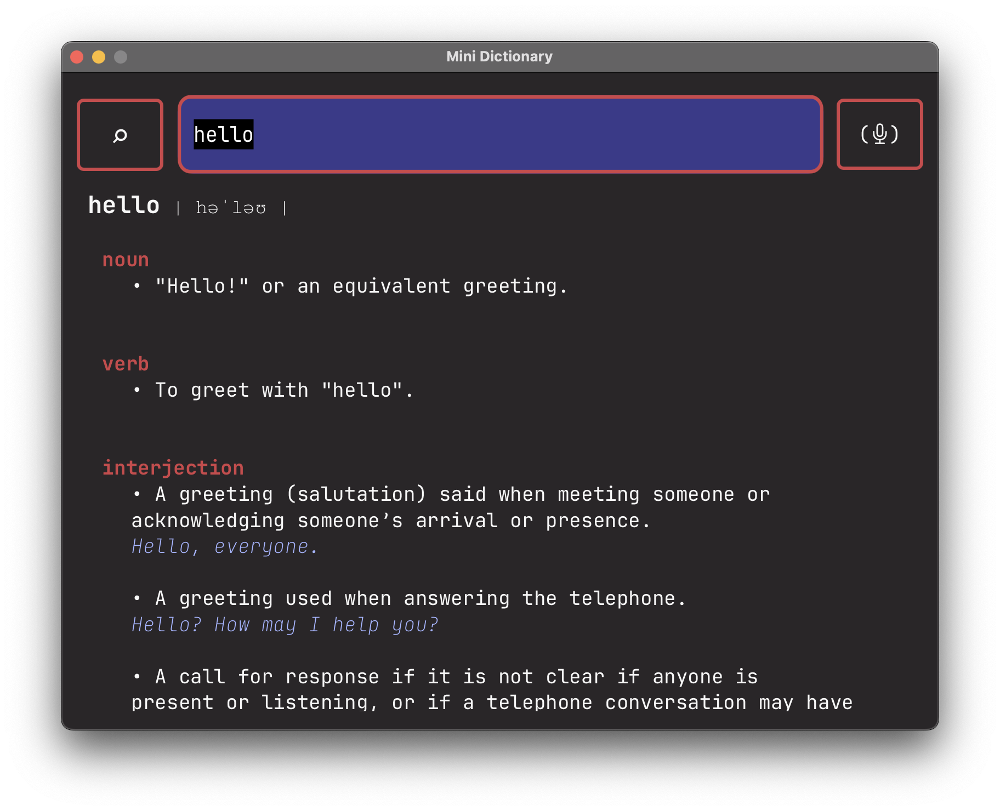
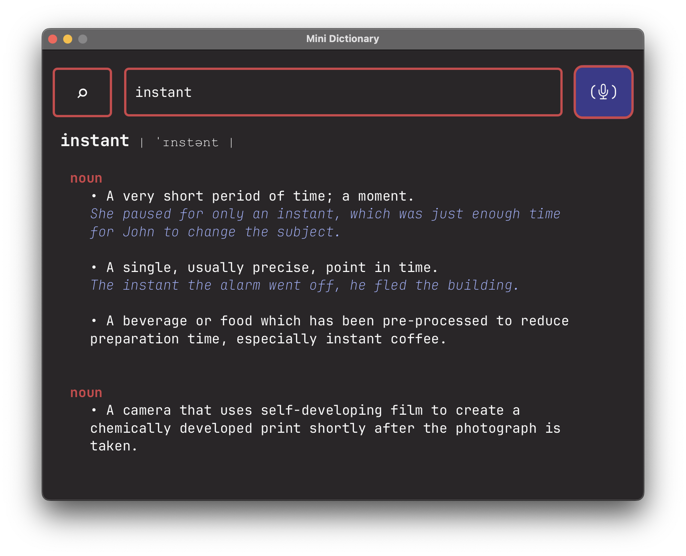

# Mini Dictionary

## Overview

A simple dictionary app, allowing you to search for words and listen to their pronunciation, with a minimal colourful theme.

Uses the [Free dictionary API](https://github.com/meetDeveloper/freeDictionaryAPI) and the Java Jackson library to serialise JSON strings into objects.

## How To Run

### Requirements

- Java JDK 22 (Java 17+ likely works)
- Maven 3.8+

```bash
# 1. Clone repo
git clone https://github.com/jude-james/dictionary.git

# 2. Change directory
cd dictionary

# 3. Run with maven
mvn clean javafx:run

# Or use included maven wrapper

# macOS/Linux
./mvnw clean javafx:run

# Windows
mvnw.cmd clean javafx:run
```

## Screenshots



